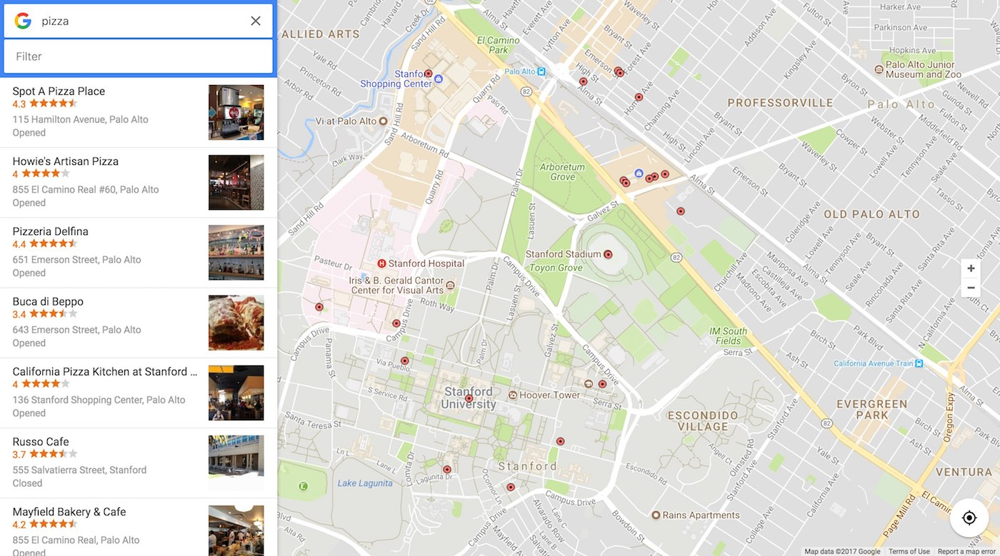

# Google Zomato Map
> Udacity Frontend Nanodegree Project 7

An app inspired by Google Maps that uses [Google Map Javascript SDK](https://developers.google.com/maps/documentation/javascript/) and [Zomato API](https://developers.zomato.com/api) to display information about different locations. The user can switch between using Google's API or Zomato API. Since Zomato is a restaurant review website it will only work when searching for restaurants.

You can view the live version [here](https://phaze1d.github.io/Google_Zomato_Maps/)

<p align="center">

</p>


## Usage
The app is very similar to Google Maps but with some differences. One is that you can switch between Zomato and Google by clicking on the Google logo next to the search bar. This will flip the logo and show you the Zomato logo which means that you are now using the Zomato API. You can revert to using the Google API by clicking on the Zomato logo. Another difference is the filter input that filters the current search results in real time.


## Development
This app is developed with [knockoutjs](http://knockoutjs.com/), a Javascript library that helps you create rich and dynamic user interfaces. I split the app into Components kind of like ReactJS so that it is easier to maintain. All the components are stored in the [src/components](src/components) folder.

### Getting Started
This app uses [npm](npmjs.com) for development. To install all the dependencies for testing and development just make sure you have npm installed and in the root directory of this project run.
```
$ npm install
$ npm run dev
```
The second command will run the webpack dev server so you can view the app locally at `localhost:8080`. Any saved changes to the code should automatically refresh the page.


## Production
To run the production build just open the `dist/index.html` file
To rebuild the production code run
```
$ npm run production
```


## Credit
* The star and half a star svg for the review section was taken and modified from [Nossie](http://codepen.io/nossie/pen/dMrKLQ)
* The spinner css was taken and modified from
[Fran Pérez](https://codepen.io/mrrocks/pen/EiplA)
* The overall design was inspired by [Google Maps](www.google.com/maps)

## Dependencies
[NodeJS 5.10](https://nodejs.org)
[NPM](https://npmjs.com)
